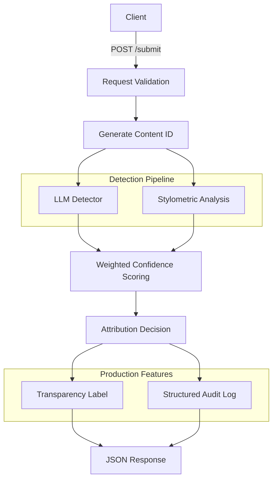

# Provenance Guard
### ***AI-Assisted Content Attribution Service***

### Overview

Provenance Guard is a Flask-based REST API that estimates whether a submitted piece of text was likely written by a human or generated with AI. Rather than relying on a single detector, the system combines two complementary detection signals into a single confidence score and presents the result using transparent, human-readable language.

The project was designed around a key idea: AI attribution systems should not simply output a binary decision. Instead, they should communicate uncertainty, provide explanations that non-technical users can understand, allow creators to appeal decisions, and maintain an auditable record of every classification.

This project was implemented as part of AI201 and demonstrates a complete detection pipeline, including:

- Multi-signal AI attribution
- Confidence scoring
- Transparency labels
- Appeals workflow
- Structured audit logging
- Rate limiting
- REST API built with Flask

---

### Features

- REST API built with Flask
- LLM-based attribution using Groq
- Stylometric heuristic analysis
- Multi-signal confidence scoring
- Human-readable transparency labels
- Appeals workflow
- Structured JSON audit log
- Rate limiting using Flask-Limiter

---

### System Architecture



The submission endpoint validates incoming requests, generates a unique content identifier, and sends the text through two independent detection signals. Their outputs are combined into a calibrated confidence score that determines the final attribution label. Every submission is written to a structured audit log before the response is returned.

---

### Detection Pipeline

Rather than depending on a single detector, Provenance Guard combines two independent signals that capture different properties of a piece of writing.

Using multiple signals reduces reliance on any single model and allows the system to express uncertainty when the detectors disagree.

#### **Signal 1 - LLM-Based Detector**

The primary detection signal uses the Groq API to analyze submitted text.

The detector receives the submission together with a prompt instructing the language model to estimate whether the writing appears AI-generated or human-written. The model returns a structured JSON response containing an AI-likelihood score between 0 and 1.

This signal captures semantic and stylistic characteristics that modern language models recognize, including:

- repetitive phrasing
- highly structured writing
- predictable transitions
- typical LLM writing patterns

**Strengths:**

- understands context
- captures higher-level writing characteristics
- performs well on polished AI-generated writing

**Limitations:** Because the detector itself is an LLM, it may incorrectly classify formal academic writing, technical documentation, and heavily edited AI text.

#### **Signal 2 - Stylometric Analysis**

The second detection signal is a handcrafted heuristic implemented entirely with the Python standard library. Instead of looking at meaning, it analyzes measurable characteristics of the writing style. Three stylometric metrics are computed.

**Sentence Length Variance**

AI-generated text frequently exhibits unusually consistent sentence lengths. Low variance contributes to a higher AI-likelihood score.

**Type-Token Ratio**

The system computes the proportion of unique words to total words. Extremely high vocabulary diversity can sometimes indicate AI-generated writing, although this metric is intentionally treated as weaker because it varies considerably on short passages.

**Punctuation Density**

The system measures punctuation marks per word. Very low punctuation density contributes to a higher AI score because AI-generated writing often contains less expressive punctuation than casual human writing.

**Strengths:**

Stylometric analysis:

- is deterministic
- requires no external API
- provides an independent signal
- captures measurable writing characteristics

**Limitations:** Stylometric heuristics do not understand meaning. Formal essays, research papers, or carefully edited writing may appear AI-like even when entirely human-written. Likewise, very short submissions contain too little information for meaningful stylometric analysis.

---

### Confidence Scoring

The outputs of both detection signals are combined into a single confidence score. 

The original planned scoring equation was:

```
Final Score = (0.65 × LLM Score) + (0.35 × Stylometric Score)
```

During implementation, testing showed that the stylometric heuristic consistently produced higher AI scores than intended for formal human writing. To improve calibration, two adjustments were introduced:

1. The stylometric score is scaled by 0.85 before being combined.
2. A disagreement penalty reduces confidence when the two detection signals strongly disagree.

The final implementation is:

```
Stylometric Score = Stylometric Score × 0.85

Confidence = 0.65 × LLM Score + 0.35 × Stylometric Score − 0.15 × |LLM Score − Stylometric Score|
```

Finally, the confidence score is clamped to the range [0,1].

#### **Classification Thresholds**

| Confidence Score | Classification |
| --- | ---: | 
| 0.00–0.30	| Likely Human | 
| >0.30–0.70	| Uncertain |
| >0.70–1.00	| Likely AI | 

#### **Confidence Validation**

To verify that confidence scores were meaningful rather than nearly constant, the system was tested using four deliberately different inputs:

- clearly AI-generated text
- clearly human-written text
- formal academic writing
- lightly edited AI-generated writing

These produced substantially different confidence scores.

**Example 1: Clearly AI-Generated Text**

Input: 
``` python
curl -s -X POST http://127.0.0.1:5000/submit \
  -H "Content-Type: application/json" \
  -d '{"creator_id": "test-1", "text": "Artificial intelligence represents a transformative paradigm shift in modern society. It is important to note that while the benefits of AI are numerous, it is equally essential to consider the ethical implications. Furthermore, stakeholders across various sectors must collaborate to ensure responsible deployment."}' | python -m json.tool
```
Output:
``` python
{
    "attribution": "likely_ai",
    "confidence": 0.7489,
    "content_id": "17957f2c-3d50-4683-9185-38747dfd476b",
    "label": "Our analysis found strong evidence that this text was generated or heavily assisted by AI. This result is based on multiple detection methods and was assigned with high confidence.",
    "signal_scores": {
        "llm": 0.92,
        "stylometric": 0.5778
    }
}
```

**Example 2: Clearly Human-Written Text**

Input:
``` python
curl -s -X POST http://127.0.0.1:5000/submit \
  -H "Content-Type: application/json" \
  -d '{"creator_id": "test-2", "text": "ok so i finally tried that new ramen place downtown and honestly? underwhelming. the broth was fine but they put WAY too much sodium in it and i was thirsty for like three hours after. my friend got the spicy version and said it was better. probably wont go back unless someone drags me there"}' | python -m json.tool
```
Output:
``` python
{
    "attribution": "likely_human",
    "confidence": 0.2878,
    "content_id": "406bf603-de43-4fe8-ad39-d1a902bb876e",
    "label": "Our analysis found strong evidence that this text was written by a person. While no automated system is perfect, this result was assigned with high confidence.",
    "signal_scores": {
        "llm": 0.23,
        "stylometric": 0.5188
    }
}
```

**Example 3: Formal Academic Writing**

Input:
``` python
curl -s -X POST http://127.0.0.1:5000/submit \
  -H "Content-Type: application/json" \
  -d '{"creator_id": "test-3", "text": "The relationship between monetary policy and asset price inflation has been extensively studied in the literature. Central banks face a fundamental tension between their mandate for price stability and the unintended consequences of prolonged low interest rates on equity and real estate valuations."}' | python -m json.tool
```
Output:
``` python
{
    "attribution": "uncertain",
    "confidence": 0.6749,
    "content_id": "2cd9a185-4728-42dd-84cf-a809aad582f8",
    "label": "Our analysis found mixed or inconclusive evidence. We cannot confidently determine whether this text was primarily written by a person or generated with AI assistance.",
    "signal_scores": {
        "llm": 0.73,
        "stylometric": 0.6198
    }
}
```

**Example 4: Lightly Edited AI-Generated Writing**

Input:
``` python
curl -s -X POST http://127.0.0.1:5000/submit \
  -H "Content-Type: application/json" \
  -d '{"creator_id": "test-4", "text": "Ive been thinking a lot about remote work lately. There are genuine tradeoffs — flexibility and no commute on one side, isolation and blurred work-life boundaries on the other. Studies show productivity varies widely by individual and role type."}' | python -m json.tool
```
Output:
``` python
{
    "attribution": "uncertain",
    "confidence": 0.3087,
    "content_id": "deb23e5c-ffe4-4722-b95b-bbcf559a8ea2",
    "label": "Our analysis found mixed or inconclusive evidence. We cannot confidently determine whether this text was primarily written by a person or generated with AI assistance.",
    "signal_scores": {
        "llm": 0.23,
        "stylometric": 0.6233
    }
}
```

These examples demonstrate that the confidence scoring system produces meaningful variation across different kinds of writing rather than returning nearly identical values.

---

### API Endpoints

| Endpoint | Method | Purpose |
| --- | --- | --- |
| `/` | GET | Health check |
| `/submit` | POST | Submit text for AI attribution |
| `/appeal` |	POST	| Appeal a previous classification |
| `/log` |	GET	| View structured audit log

#### **Example Submission Response**

Example response returned from `/submit`:
``` 
{
  "content_id": "...",
  "attribution": "likely_ai",
  "confidence": 0.7489,
  "label": "...",
  "signal_scores": {
    "llm": 0.92,
    "stylometric": 0.5778
  }
}
```

The response includes:

- attribution result
- confidence score
- transparency label
- individual signal scores
- unique content identifier

---

### Transparency Labels

The API returns plain-language explanations instead of exposing only numerical scores.

#### **Likely AI**

> "Our analysis found strong evidence that this text was generated or heavily assisted by AI. This result is based on multiple detection methods and was assigned with high confidence."

#### **Uncertain**

> "Our analysis found mixed or inconclusive evidence. We cannot confidently determine whether this text was primarily written by a person or generated with AI assistance."

#### **Likely Human**

> "Our analysis found strong evidence that this text was written by a person. While no automated system is perfect, this result was assigned with high confidence."

These labels intentionally avoid technical terminology so that non-expert users can understand the result without interpreting raw model scores.

---

### Appeals Workflow

Users may appeal any attribution decision.

The `/appeal` endpoint accepts:

```
{
  "content_id": "...",
  "creator_reasoning": "..."
}
```

Submitting an appeal:

- updates the submission status to under_review
- stores the creator's reasoning
- records the appeal timestamp
- preserves the original classification

No automatic re-classification occurs; instead, the appeal is recorded for future review.

---

### Audit Logging

Every submission creates a structured JSON audit entry.

Each record includes:

- timestamp
- content ID
- creator ID
- attribution result
- confidence score
- LLM score
- stylometric score
- status

Appealed submissions additionally include:

- appeal reasoning
- appeal timestamp

Structure:

```
{
  "content_id": "...",
  "creator_id": "...",
  "timestamp": "...",
  "attribution": "uncertain",
  "confidence": 0.3135,
  "llm_score": 0.23,
  "stylometric_score": 0.6477,
  "status": "under_review",
  "appeal_reasoning": "...",
  "appeal_timestamp": "..."
}
```

Example:

```
{
    "content_id": "24331676-cfbb-426b-9d9e-289fccfa48b8",
    "creator_id": "test-user-1",
    "timestamp": "2026-06-28T10:08:42.071009+00:00",
    "attribution": "uncertain",
    "confidence": 0.3135,
    "llm_score": 0.23,
    "stylometric_score": 0.6477,
    "status": "under_review",
    "appeal_reasoning": "I wrote this myself.",
    "appeal_timestamp": "2026-06-28T10:09:27.611570+00:00"
  }
```

The structured audit log supports transparency, debugging, and future review of attribution decisions.

---

### Rate Limiting

To prevent automated abuse while still supporting realistic usage, Provenance Guard uses Flask-Limiter with the following limits:

| Limit	| Purpose |
| --- | --- | 
| 10 requests per minute | Prevents scripts from flooding the API with rapid automated submissions while allowing users to quickly revise and resubmit drafts. |
| 1000 requests per day	| Allows extensive legitimate use (such as students, writers, or developers testing multiple drafts) while still preventing large-scale automated scraping or abuse over a prolonged period. |

These limits were selected to balance usability with abuse prevention rather than relying on  Flask-Limiter's defaults.

Testing the limiter by sending 12 rapid requests produced:


The first ten requests were processed successfully, while subsequent requests were rejected with HTTP 429 Too Many Requests, demonstrating that the limiter is functioning correctly.

---

### Known Limitations

Although the system combines multiple detection signals, it is not perfect.

One important limitation is formal academic writing. Research papers, technical reports, and scholarly essays often exhibit:

- consistent sentence lengths
- high vocabulary diversity
- structured organization

These characteristics overlap with several stylometric indicators associated with AI-generated text, which may produce higher confidence scores than intended.

Another limitation is very short text. A single sentence provides too little stylistic information for meaningful variance or vocabulary analysis, making the stylometric signal less reliable.

Finally, heavily edited AI-generated writing may resemble human writing after sufficient revision, reducing the effectiveness of both detection signals.

---

### Spec Reflection

The planning specification significantly shaped the final implementation.

Designing the architecture, detection signals, and confidence thresholds before writing code made the implementation much more organized and reduced later refactoring. Having a clearly defined API contract also simplified testing because expected request and response formats were established in advance.

One notable divergence occurred during confidence scoring.

The original specification combined the two detection signals using only a weighted average. During implementation, testing showed that the stylometric heuristic consistently produced stronger AI scores than intended, particularly for formal human writing. To improve calibration, the final implementation introduced a stylometric scaling factor and a disagreement penalty that reduces confidence when the two signals strongly disagree. This change better reflected uncertainty while preserving the original threshold ranges.

---

### AI Usage

AI tools were used throughout development as engineering assistants rather than as final code generators.

#### **Instance 1 — Flask Application Skeleton**

I provided my architecture diagram together with the detection pipeline from my planning document and asked Claude to generate an initial Flask application skeleton containing the `/submit` endpoint.

The generated code provided the overall route structure and request validation, but I revised the implementation substantially by reorganizing the endpoint, adding structured error handling, integrating audit logging, implementing confidence scoring, and matching the API contract defined in my specification.

#### **Instance 2 — Stylometric Analysis**

I asked Claude to generate an initial stylometric analysis module implementing several heuristic features using only the Python standard library.

The generated implementation served as a starting point, but I revised the calibration ranges after testing, weakened the influence of the type-token ratio, scaled the stylometric contribution within the confidence scorer, introduced a disagreement penalty between the two detection signals, improved documentation, and added additional edge-case handling for empty and short inputs.

These revisions ensured that the final implementation better matched the behavior described in my planning document and produced more meaningful confidence scores across a variety of test cases.

---

### Future Improvements

If this system were deployed beyond a course project, several improvements would be valuable:

- Replace handcrafted stylometric heuristics with a trained statistical classifier.
- Evaluate confidence calibration using a labeled benchmark dataset.
- Replace the JSON audit log with a relational database.
- Add authentication and authorization for the audit log.
- Introduce asynchronous processing for longer submissions.
- Implement human review workflows for appealed submissions.
- Add additional detection signals, such as watermark verification or embedding-based classifiers.