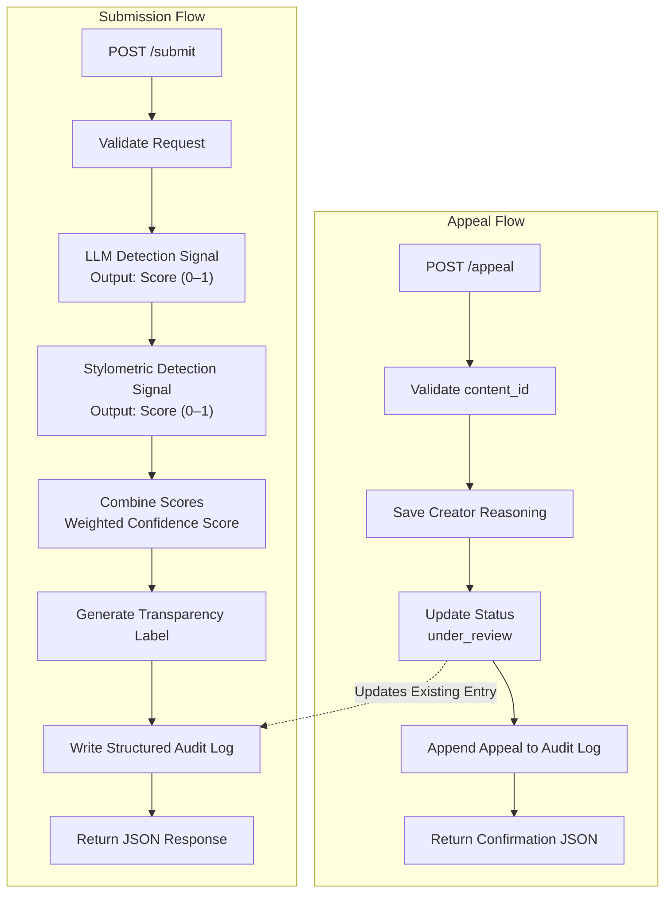

# Provenance Guard - Planning Document

### Project Overview

Provenance Guard is a backend API that analyzes submitted text and estimates whether it is more likely to be AI-generated or human-written. The goal is **not** to make perfect attribution decisions, but to provide a transparent confidence score, communicate uncertainty honestly, allow creators to appeal incorrect classifications, and maintain an auditable record of every decision.

The system consists of two primary workflows:

1. **Submission Workflow**

- Accept text from a creator.
- Analyze it using multiple independent detection signals.
- Combine the signals into a confidence score.
- Generate a user-friendly transparency label.
- Store the decision in an audit log.
- Return the result to the client.

2. **Appeal Workflow**

- Allow creators to dispute an attribution decision.
- Record the creator's reasoning.
- Mark the submission as "under review."
- Preserve both the original classification and the appeal in the audit log.

---

### Detection Signals

The system uses two independent detection signals. Using multiple signals reduces reliance on a single imperfect classifier and provides more trustworthy confidence estimates.

#### **Signal 1: LLM-Based Attribution**

**Description:** A Groq-hosted Llama 3.3 model evaluates whether a piece of writing appears more likely to be AI-generated or human-written. The prompt instructs the model to consider: overall writing style, consistency, coherence, predictability, repetitiveness, and natural language variation. 

The model returns a structured response containing:

```
{
    "classification": "likely_ai",
    "score": 0.86
}
```

where:

- 0.0 = strongly human
- 1.0 = strongly AI 

**What It Measures:** This signal captures high-level semantic and stylistic patterns that humans naturally recognize but are difficult to measure numerically. Examples include repetitive phrasing, overly polished transitions, generic explanations, unusually balanced structure, and lack of personal specificity. 

**Strengths:**

- Understands context.
- Recognizes nuanced writing patterns.
- Performs well on longer passages.

**Blind Spots:** The LLM may incorrectly classify highly formal academic writing, carefully edited human writing, and AI-generated writing intentionally edited by humans. It is also influenced by prompt wording and therefore should never be the only signal used.

#### **Signal 2: Stylometric Heuristics**

**Description:** This signal computes measurable statistical characteristics directly from the submitted text. Metrics include:

1. **Sentence Length Variance:** Measures how much sentence lengths vary. Human writing typically alternates between short and long sentences. AI writing often produces more uniform sentence lengths.
2. **Type-Token Ratio (Vocabulary Diversity):** Measures unique words/total words. Higher diversity generally suggests more natural vocabulary usage. Lower diversity may indicate repetitive AI wording.
3. **Punctuation Density:** Measures punctuation marks relative to total words. Extremely regular punctuation usage can be a characteristic of AI-generated writing.

The metrics are normalized into a stylometric score between

- 0.0 = strongly human, and
- 1.0 = strongly AI

**Strengths:**

- Produces objective measurements.
- Completely independent of any language model.
- Fast and inexpensive to compute.

**Blind Spots:** Stylometric analysis can misclassify poetry, song lyrics, legal documents, technical documentation, and intentionally minimalist writing, because these styles naturally differ from conversational prose.

#### **Combining Detection Signals**

Both signals return a score between 0 and 1. The final confidence score is calculated using a weighted average. 

> Final Score = (0.65 × LLM Score) + (0.35 × Stylometric Score)

The LLM receives a slightly higher weight because it captures broader semantic context, while stylometric heuristics provide an independent structural check. The final score also determines the attribution result.

---

### Uncertainty Representation

The system intentionally avoids making overly confident claims.

Scores are interpreted as follows:

| Final Score | Classification |
| --- | ---: |
| 0.00 - 0.30 | Likely Human | 
| >0.30 - 0.70 | Uncertain |
| >0.70 - 1.00 | Likely AI | 

The "Uncertain" category is intentionally wide because false positives (incorrectly labeling human writing as AI-generated) are considered more harmful than false negatives.

*NOTE:* A score of 0.60 does not mean the text is "60% AI". Instead, it means: 

> "The available evidence slightly favors AI-generated writing, but the signals do not agree strongly enough for a confident attribution."

This distinction will also be communicated in the transparency label.

---

### Transparency Label Design

The backend returns both the numerical confidence score and plain-language label text.

#### **High-Confidence AI**

> **Likely AI-Generated**
>
> Our analysis found strong evidence that this text was generated or heavily assisted by AI. This result is based on multiple detection methods and was assigned with high confidence.

#### **Uncertain**

> **Unable to Determine**
>
> Our analysis found mixed or inconclusive evidence. We cannot confidently determine whether this text was primarily written by a person or generated with AI assistance.

#### **High-Confidence Human**

> **Likely Human-Written**
>
> Our analysis found strong evidence that this text was written by a person. While no automated system is perfect, this result was assigned with high confidence.

---

### Appeals Workflow

**Who Can Appeal?** The creator who originally submitted the content.

**Appeal Request:** `POST /appeal`

- Required fields: `content_id` and `creator_reasoning`

Example: 

```
{ 
    "content_id": "...", 
    "creator_reasoning": "I wrote this essay myself over several weeks. I also use grammar correction software, which may explain why the writing appears polished." 
}
```

#### **System Actions**

When an appeal is submitted:

1. Locate the original submission.
2. Change status: `classified` → `under_review`

3. Store appeal timestamp, creator reasoning, original attribution, and confidence score. 
4. Add a new audit log entry. 

#### **Human Reviewer View**

A reviewer should see: 

- Content ID
- Creator ID
- Original Text
- LLM Score
- Stylometric Score
- Combined Confidence
- Attribution Result
- Creator Reasoning
- Current Status
- Submission Timestamp
- Appeal Timestamp

--- 

### Anticipated Edge Cases

#### **Edge Case 1: Poetry**

Poems often contain:

- repeated words
- short sentences
- unusual punctuation
- simple vocabulary

Stylometric heuristics may incorrectly interpret these characteristics as AI-generated.

#### **Edge Case 2: Academic Writing**

Research papers naturally contain:

- formal language
- consistent sentence structure
- objective tone

The LLM may incorrectly associate these features with AI writing.

#### **Edge Case 3: Human-Edited AI Writing**

Someone may generate text using AI and substantially rewrite it. The LLM may still detect AI patterns while stylometric features appear human. The system should produce an "Uncertain" result rather than making a confident attribution.

#### **Edge Case 4: Very Short Submissions**

Examples of this include tweets, titles, headlines, short, and poems. There is not enough information for either signal to produce reliable results. The confidence score should naturally fall into the "Uncertain" range.

---

### API Design

`POST /submit`

**Request:**

```
{ 
    "creator_id": "...", 
    "text": "..." 
}
```

**Response:**

```
{ 
    "content_id": "...",
    "attribution": "likely_ai", 
    "confidence": 0.82,
    "label": "...",
    "signal_scores": { 
        "llm": 0.88,
        "stylometric": 0.71 
    }
}
```

`POST /appeal`

**Request:**

```
{ 
    "content_id": "...",
    "creator_reasoning": "..." 
}
```

**Response:**

```
{ 
    "status": "under_review",
    "message": "Appeal submitted successfully." 
}
```

`GET /log`

*Returns every structured audit log entry.*

---

### Architecture




A submitted piece of text enters the `POST /submit` endpoint, where the request is validated before passing through two independent detection signals: an LLM-based classifier and a stylometric analysis module. Their outputs are combined into a weighted confidence score, which determines the attribution result and the transparency label returned to the client. Every classification is stored in a structured audit log. If a creator disputes the decision, they can submit an appeal through `POST /appeal`; the system records their reasoning, updates the submission's status to `under_review`, appends the appeal to the existing audit log entry, and returns a confirmation response.

---

### AI Tool Plan

#### **Milestone 3: Submission Endpoint & First Signal**

**Spec Sections Provided:** Detection Signals, API Design, Architecture Diagram

**AI Request:** Generate Flask project skeleton, `POST /submit` endpoint, Groq LLM detection function, and JSON response structure

**Verification:**

- Test endpoint using curl.
- Confirm JSON structure matches the API specification.
- Verify the LLM function returns scores between 0 and 1 before integrating it into the endpoint.

#### **Milestone 4: Second Signal & Confidence Scoring**

**Spec Sections Provided:** Detection Signals, Uncertainty Representation, Architecture Diagram

**AI Request:** Generate stylometric analysis function, weighted confidence calculation, and signal score aggregation

**Verification:**

Test four inputs: 

- clearly AI
- clearly human
- formal academic writing
- lightly edited AI writing

Verify that:

- signal scores differ appropriately
- confidence values change meaningfully
- uncertain cases fall within the defined threshold range

#### **Milestone 5: Production Layer**

**Spec Sections Provided:** Transparency Labels, Appeals Workflow, Architecture Diagram

**AI Request:** Generate label generation function, `POST /appeal` endpoint, audit log updates, status management, and rate limiting integration

**Verification:**

Confirm: 

- all three transparency labels can be produced
- submitting an appeal changes status to "under_review"
- appeal reasoning appears in the audit log
- rate limiting returns HTTP 429 when the configured limit is exceeded
- the audit log contains at least three structured entries, including one appeal

